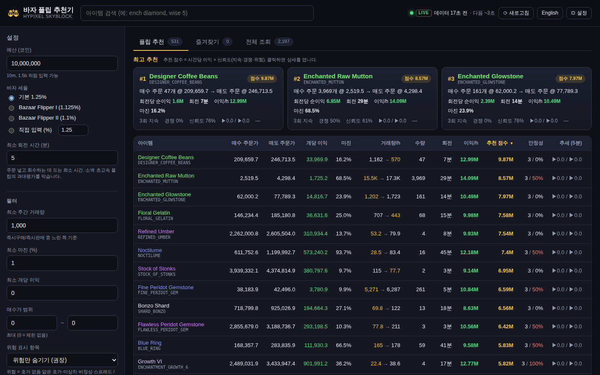
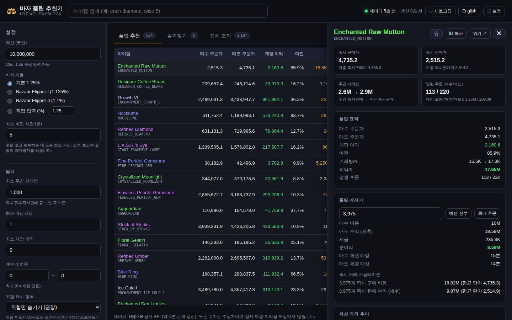
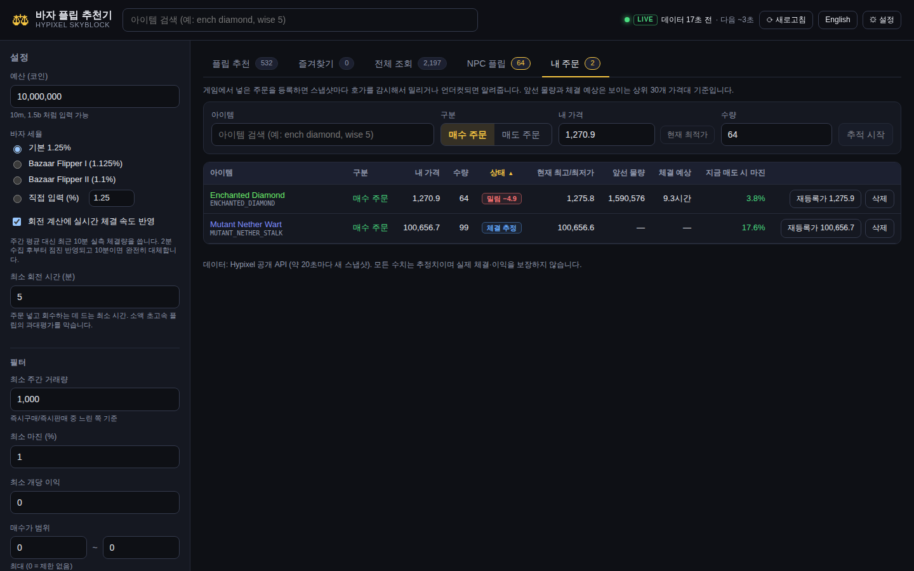
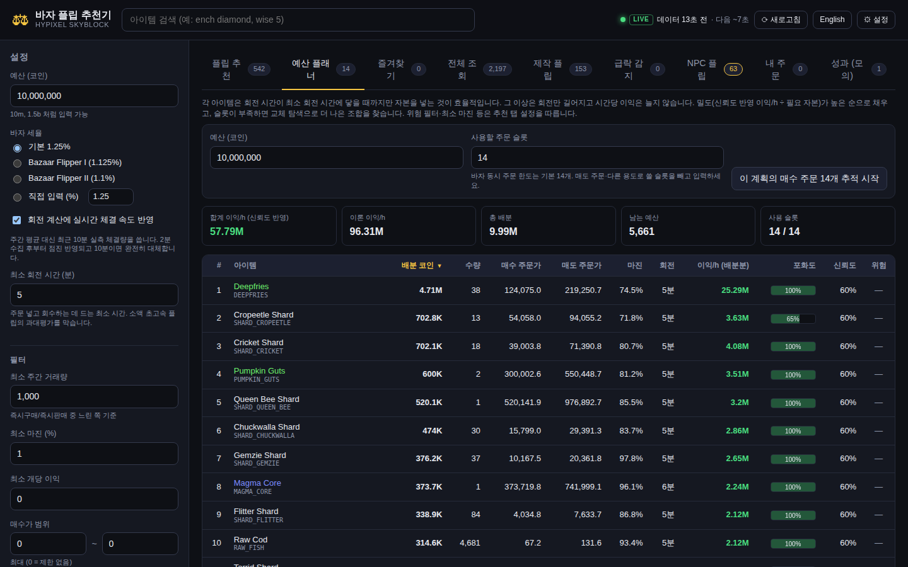
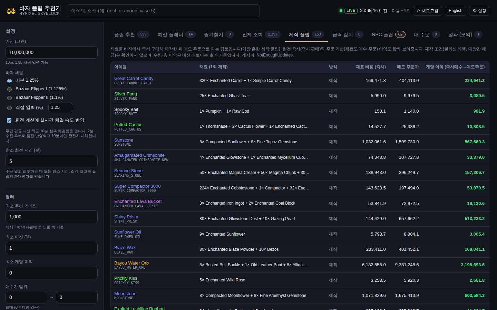

# 바자 플립 추천기 · Hypixel SkyBlock Bazaar Flipper

Hypixel SkyBlock 바자(Bazaar)의 **플립(매수 주문 → 매도 주문) 추천기**이자 **아이템 시세 조회기**입니다.
Hypixel 공개 API를 브라우저에서 직접 호출하므로 서버나 API 키가 필요 없고, 정적 사이트(GitHub Pages 등)로 그대로 배포할 수 있습니다.

> **English summary** — A client-only React + TypeScript app that ranks Hypixel SkyBlock bazaar flips
> (place a buy order one tick above the best bid, sell one tick below the best ask) by a budget-aware
> profit-per-hour estimate, flags suspicious markets, and provides an order-book / calculator view for
> every product. No API key, no backend. `npm install && npm run dev`.











## 주요 기능

**플립 추천 탭**
- 모든 바자 상품에 대해 *매수 주문가 = 현재 최고 매수 주문 + 0.1*, *매도 주문가 = 현재 최저 매도 주문 − 0.1* 기준으로 계산
- 세후 개당 이익, 마진 %, 시간당 거래량(즉시판매 → 즉시구매), 예산으로 살 수 있는 수량, 회전 시간, 회전당 이익, **시간당 예상 이익**
- 예산·세율(Bazaar Flipper 퍽)·최소 거래량·최소 마진·가격 범위 필터 (설정은 브라우저에 저장)
- 위험 표시: 호가 없음 · 얇은 호가 · 매수/매도 이상치(단일 주문) · 거래량 불균형 · 비정상 스프레드 · 거래량 부족
- 모든 컬럼 정렬 가능, 아이템 이름/ID 검색 (`ench dia`, `wise 5` 처럼 토큰 검색)

**최고 추천 + 추천 점수**
- 추천 탭 상단에 지금 가장 좋은 플립 3개를 "매수 주문 N개 @ 가격 → 매도 주문 @ 가격" 형태로 보여줍니다.
- 정렬 기준인 **추천 점수 = 시간당 이익 × 신뢰도**. 신뢰도는 페이지를 열어둔 동안 쌓인 스냅샷 이력에서 계산합니다.
  - *지속*: 스프레드가 유지된 연속 스냅샷 수 (1회만 보인 스프레드는 할인, 5회 이상이면 만점)
  - *경쟁*: 최근 10 스냅샷 중 다른 플리퍼가 최고 매수 주문을 앞지르거나 최저 매도 주문을 언더컷한 비율 (자연 체결로 호가가 움직이는 방향은 제외)
  - *위험/경고 감점*: 경고 1개당 ×0.75, 위험 1개당 ×0.3
- **추세** 컬럼은 내 매수가/매도가의 최근 5분 변화입니다. 매도가▲·매수가▼면 스프레드가 벌어지는 중입니다.
- 이력은 메모리에만 있으므로 페이지를 연 직후에는 "이력 수집 중"으로 표시되고 1~2분 뒤부터 안정성 신호가 채워집니다.

**알림**
- 설정 → 알림에서 켜면, 스냅샷마다 **새로** 조건(최소 점수·최소 마진·즐겨찾기만·위험 없음)을 만족한 아이템을 화면 우하단 토스트 + 브라우저 알림 + 소리로 알립니다.
- 탭이 백그라운드여도 브라우저 알림은 뜹니다(권한 필요). "테스트 알림" 버튼으로 확인할 수 있습니다.

**내 주문 추적기**
- 게임에서 넣은 매수/매도 주문을 등록하면(상세 패널의 "주문 추적" 버튼 또는 내 주문 탭의 폼) 스냅샷마다 호가창과 비교해 상태를 보여줍니다: 최상단 · 밀림(−차이) · 언더컷됨 · 체결 추정 · 호가 없음.
- 앞선 물량, 동가 주문 수, 체결 예상 시간, 재등록가(현재 최고가 ± 0.1), 매수 주문이면 지금 매도 시 마진까지 표시합니다.
- 밀리거나 언더컷되거나 호가에서 사라지면(체결 추정) 토스트 + 브라우저 알림 + 소리로 알립니다. 주문을 방치해서 회전이 멈추는 것을 막는 게 목적입니다.

**실시간 체결 속도**
- API의 주간 거래량 값은 체결마다 증가하는 카운터라(만료는 드물게 한꺼번에 빠짐) 스냅샷 간 증가분을 합치면 최근 10분의 실제 체결량이 됩니다.
- 2분 수집 후부터 주간 평균과 섞어 쓰고 10분이면 완전히 대체합니다. 거래량/h 셀에 `LIVE` 표시와, 평소 대비 활동 배율(×1.5 이상 또는 ×0.5 이하일 때)이 붙습니다. 설정에서 끌 수 있습니다.

**NPC 플립**
- 아이템 카탈로그의 NPC 판매가보다 싼 매도 주문이 있으면 NPC 플립 탭에 나타납니다. 호가창을 따라 예산 안에서 살 수 있는 수량과 총 이익을 계산합니다. NPC 판매에는 바자 세금이 없습니다.

**예산 플래너**
- 예산과 사용할 주문 슬롯 수(기본 14)를 넣으면 시간당 이익(신뢰도 반영)이 최대가 되는 아이템 조합과 각각의 배분 코인·수량을 제시합니다.
- 원리: 아이템별로 회전 시간이 최소 회전 시간에 닿는 자본 한도가 있고, 그 이상은 회전만 길어져 이익/h가 늘지 않습니다. 밀도(이익/h ÷ 필요 자본) 순으로 한도까지 채운 뒤, 슬롯이 부족한 경우를 위해 교체 탐색으로 다듬습니다 (`src/lib/planner.ts`).
- "이 계획의 매수 주문 추적 시작" 버튼으로 계획 전체를 내 주문 추적기에 한 번에 등록합니다.

**제작 플립**
- NotEnoughUpdates 레시피(제작·대장간) 중 재료와 결과물이 모두 바자 상품인 것을 `src/data/recipes.json`에 담아 둡니다 (`npm run update-recipes`로 갱신, jsDelivr 미러 사용).
- 즉시매수 재료 → 매도 주문(일반적인 제작 플립), 완전 즉시, 주문 기반 세 가지 이익을 보여주고, 예산과 보이는 호가 깊이로 제작 횟수·총 이익·판매 소요 시간을 계산합니다. 제작 조건(컬렉션·대장간 해금)은 확인하지 않습니다.

**급락 감지 + 장기 이력**
- 스냅샷을 5분 버킷(평균가·최저/최고가·체결량)으로 묶어 브라우저 IndexedDB에 48시간 보관합니다. 페이지를 열어둔 동안만 수집됩니다.
- 24시간 기준가(5분 평균의 중앙값) 대비 크게 싸진 아이템을 하락률·회복 시 마진과 함께 보여줍니다 (아이템당 최소 2시간 이력 필요).
- 상세 패널의 장기 차트는 Coflnet 공개 API의 24시간/7일 이력을 쓰고, 실패하면 수집 이력으로 대체합니다.

**성과 (모의 매매)**
- 5분마다 추천 1위를 가상 주문으로 기록하고 이후 실제 스냅샷의 호가·체결량으로 체결을 시뮬레이션합니다 (밀리면 재입찰, 언더컷되면 재등록, 맨 앞일 때 체결량 전부 수령 가정, 6시간 후 만료).
- 실현 합계 ÷ 예상 합계(포착률), 승률, 평균 소요로 추천의 정확도를 가늠할 수 있습니다. 기록은 브라우저에 저장됩니다.

**아이템 상세 패널** (행 클릭)
- 즉시 구매가/즉시 판매가, 가중 평균가, 주간 거래량, 열린 주문 수
- 플립 요약 + 신호(점수·신뢰도 구성·지속·경쟁·추세) + **플립 계산기** (수량 → 매수 비용, 세금, 세후 수익, 순이익, 체결 예상 시간)
- **즉시 거래 시뮬레이션**: 호가창을 따라가며 N개를 즉시 구매/판매했을 때의 실제 비용·수익
- 호가창(매수 주문 / 매도 주문 상위 12단계, 누적 물량 바)
- 페이지를 열어둔 동안의 세션 가격 추이 차트
- 즐겨찾기(★), ID 복사, 위키 링크

**전체 조회 탭** — 2,000여 개 상품 전체를 시세·거래량·주문 수 기준으로 정렬/검색
**즐겨찾기 탭** — 필터와 무관하게 즐겨찾기한 아이템의 플립 지표를 항상 표시

**실시간 모드 (기본)**
- Hypixel API는 `lastUpdated`가 **정확히 20초마다** 바뀌고, 새 스냅샷은 1~2초 안에 CDN에 반영됩니다 (2026-09 측정).
- 실시간 모드는 이 주기를 학습해서 **다음 스냅샷이 나온 직후(약 1.5초 뒤)** 에 맞춰 받아옵니다. 아직 안 바뀌었으면 2초 간격으로 몇 번 더 확인합니다.
- 응답 헤더의 `max-age=60` 때문에 브라우저 캐시가 옛 데이터를 돌려주지 않도록 매번 조건부 요청(`cache: 'no-cache'`)을 보냅니다. 스냅샷이 그대로면 CDN이 본문 없는 304로 답하므로 트래픽 부담도 거의 없습니다.
- 헤더에 `LIVE` 배지, 스냅샷 기준 데이터 나이, 다음 스냅샷까지 카운트다운이 표시되고, 값이 바뀐 셀은 초록/빨강으로 잠깐 깜빡입니다.
- 어떤 사이트도 이 API보다 빠를 수는 없습니다(모두 같은 소스). 이 방식이면 스냅샷 발행 후 2~3초 안에 화면에 반영되어 사실상 최대 속도입니다. 설정에서 고정 간격 폴링으로 바꿀 수도 있습니다.

한국어/영어 UI 전환, 탭이 백그라운드일 때는 갱신을 멈추고 돌아오면 즉시 받아옵니다.

## 실행

```bash
npm install
npm run dev        # http://localhost:5173
```

```bash
npm test           # 플립 계산·이름·포맷 단위 테스트 (vitest)
npm run typecheck  # tsc --noEmit
npm run build      # dist/ 에 정적 파일 생성
npm run preview    # 빌드 결과 미리보기
```

## 배포

정적 사이트라 어디에나 올릴 수 있습니다. 빌드 명령 `npm run build`, 출력 폴더 `dist`.

**GitHub Pages (공개 저장소)**
`.github/workflows/deploy.yml`이 `main`에 푸시될 때마다 빌드해서 `gh-pages` 브랜치에 올리고, GitHub Pages가 그 브랜치를 게시합니다.
주소는 `https://<user>.github.io/<repo>/` 이고, `vite.config.ts`의 `base: './'` 덕분에 하위 경로에서도 그대로 동작합니다.
사이트가 안 보이면 **Settings → Pages → Build and deployment → Source: Deploy from a branch → `gh-pages` / (root)** 를 한 번만 선택해 주세요.

> 무료 플랜의 **비공개 저장소에서는 GitHub Pages를 쓸 수 없습니다.** 저장소를 공개로 바꾸거나 GitHub Pro로 올리면 됩니다.

**비공개 저장소를 유지하면서 무료로 배포하기** — 아래 서비스는 비공개 GitHub 저장소를 무료로 연결할 수 있습니다. 대시보드에서 저장소를 가져온 뒤 다음 값만 넣으면 됩니다.

| 서비스 | 빌드 명령 | 출력 폴더 | 비고 |
| --- | --- | --- | --- |
| Cloudflare Pages | `npm run build` | `dist` | 프레임워크 프리셋 "Vite" 선택 |
| Netlify | `npm run build` | `dist` | 저장소의 `netlify.toml`이 자동 적용됨 |
| Vercel | `npm run build` | `dist` | 프레임워크 "Vite" 자동 감지 |

## 계산 방식

API 필드 이름은 "플레이어가 하는 행동" 기준이라 헷갈리기 쉽습니다 (`src/api/bazaar.ts` 주석 참고).

| API 필드 | 의미 |
| --- | --- |
| `buy_summary` | 다른 유저의 **매도 주문** (내가 즉시 구매할 때 체결되는 쪽), 오름차순 |
| `sell_summary` | 다른 유저의 **매수 주문** (내가 즉시 판매할 때 체결되는 쪽), 내림차순 |
| `buyMovingWeek` | 최근 7일간 즉시 구매된 수량 → **내 매도 주문**을 채워 줌 |
| `sellMovingWeek` | 최근 7일간 즉시 판매된 수량 → **내 매수 주문**을 채워 줌 |

`src/lib/flip.ts`:

```
매수 주문가  = sell_summary[0].price + 0.1
매도 주문가  = buy_summary[0].price − 0.1
개당 이익    = 매도 주문가 × (1 − 세율) − 매수 주문가        # 세금은 판매 시에만
수량         = min(⌊예산 / 매수 주문가⌋, 71,680)              # 주문당 최대 수량
회전 시간    = 수량 / (sellMovingWeek/168) + 수량 / (buyMovingWeek/168)
시간당 이익  = 수량 × 개당 이익 / max(회전 시간, 최소 회전 시간)
```

"회전 시간"은 내 주문이 항상 대기열 맨 앞에 있다고 가정한 **낙관적** 추정입니다.
경쟁 주문 수(매수 주문 / 매도 주문)를 함께 보고 판단하세요. 위험 표시의 기준값은 `flip.ts` 상단 상수로 조정할 수 있습니다.

## 아이템 이름 갱신

이름/등급은 `src/data/item-names.json`에 들어 있습니다 (Hypixel 아이템 카탈로그에서 생성, NPC 판매가 포함).
카탈로그에 없는 상품(인챈트 북, 샤드, 에센스 등)은 ID로부터 이름을 만들어 냅니다 (`src/lib/names.ts`).
새 아이템이 추가되면 아래 명령으로 다시 생성하세요.

```bash
npm run update-names     # 아이템 이름·등급·NPC 판매가
npm run update-recipes   # NEU 레시피 (약 2,200개 파일, 몇 분 소요)
```

## 프로젝트 구조

```
src/
  api/bazaar.ts        Hypixel Bazaar API 타입 + fetch
  lib/flip.ts          플립 계산, 위험 플래그, 필터/랭킹, 호가 워킹, 계산기   (순수 함수, 테스트 대상)
  lib/names.ts         상품 ID → 표시 이름/등급
  lib/format.ts        숫자/시간 포맷, "10m" 같은 입력 파싱
  lib/search.ts        토큰 기반 검색
  lib/history.ts       세션 내 가격 이력 (스파크라인용)
  lib/schedule.ts      스냅샷 주기 학습 + 실시간 폴링 스케줄 (순수 함수, 테스트 대상)
  lib/signals.ts       지속/경쟁/추세 신호와 신뢰도·추천 점수 (순수 함수, 테스트 대상)
  lib/alerts.ts        알림 규칙 매칭 (순수 함수, 테스트 대상)
  lib/sound.ts         Web Audio 알림음
  lib/rates.ts         이동 주간 카운터 증가분 → 실시간 체결 속도, 주간 평균과 블렌딩 (테스트 대상)
  lib/orders.ts        내 주문 상태 평가: 밀림/언더컷/체결 추정, 앞선 물량, 체결 예상 (테스트 대상)
  lib/npc.ts           NPC 플립 계산 (테스트 대상)
  lib/planner.ts       예산 배분 플래너 (테스트 대상)
  lib/craft.ts         제작 플립 계산 (테스트 대상)
  lib/buckets.ts       5분 버킷 집계, lib/histdb.ts IndexedDB 보관, lib/crash.ts 급락 감지 (테스트 대상)
  api/coflnet.ts       Coflnet 장기 이력 (상세 차트용, 선택)
  lib/paper.ts         모의 매매 시뮬레이션과 성과 요약 (테스트 대상)
  hooks/               폴링, localStorage 상태, 번역
  components/          헤더, 설정 패널, 정렬 테이블, 상세 패널, 호가창, 스파크라인
  i18n.ts              한국어/영어 문자열
  settings.ts          앱 설정 모델과 기본값
scripts/update-item-names.mjs   이름 데이터 재생성
tests/                 vitest 단위 테스트
```

## 참고

- 데이터 출처: `https://api.hypixel.net/v2/skyblock/bazaar` (공개, 키 불필요, 20초마다 새 스냅샷)
- 모든 수치는 추정치이며 실제 체결이나 이익을 보장하지 않습니다.
- Hypixel 및 SkyBlock은 Hypixel Inc.의 상표이며, 이 프로젝트는 비공식 팬 도구입니다.
